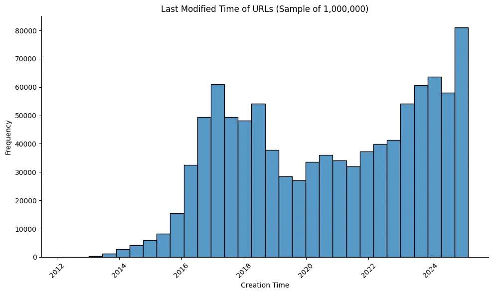
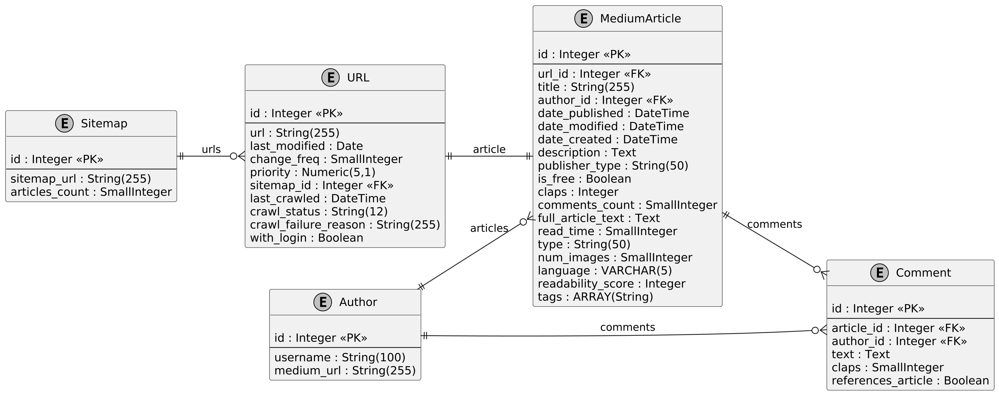
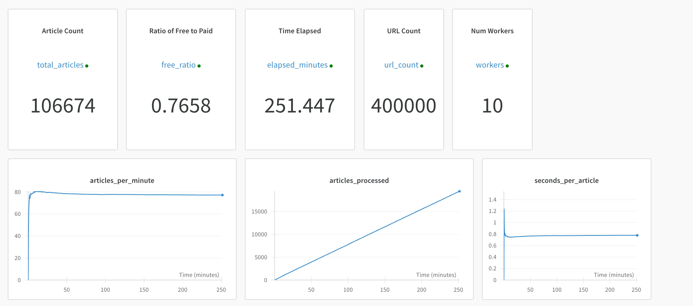

# Medium Mining: Comparative Analysis of Paid and Free Articles on Medium.com

<div align="center">

**A comprehensive study analyzing 65,248 Medium.com articles to understand the differences between paid (member-only) and free content**


</div>

---

## Table of Contents

1. [Project Overview](#project-overview)
2. [Data Acquisition](#data-acquisition)
3. [Dataset & Descriptive Analysis](#dataset--descriptive-analysis)
4. [Topic Modeling Results](#topic-modeling-results)
5. [Reproduction Guide](#reproduction-guide)
6. [Project Structure](#project-structure)
7. [Contributors](#contributors)

---

## Project Overview

This project investigates the characteristics and engagement patterns of paid versus free articles on Medium.com through a systematic analysis of a large-scale scraped dataset. By leveraging web scraping with Playwright, embedding-based topic modeling, and statistical analysis, we uncover significant differences in how authors monetize content based on topic and engagement metrics.

### Key Findings

- **33.6%** of analyzed articles are member-only (paid), **66.4%** are free
- Paid articles receive **3.3x more claps** on average (407.9 vs 122.4)
- Paid articles generate **4x more responses** (4.9 vs 1.2)
- **Strong correlation between article topic and monetization status**
- Technical topics (Crypto, Engineering) skew heavily toward free content
- Personal/wellness topics lean toward paid/member-only content

### Legal & Ethical Considerations

This research was conducted with explicit permission from Medium's legal department. The scraping process respects:
- Ethical rate limiting with Gaussian-distributed delays (mean 0.05s)
- robots.txt compliance
- Use exclusively for academic research
- No data redistribution or commercialization

---

## Data Acquisition

### Challenge: No Public API

Medium.com does not provide an official public API for data access, and web scraping is prohibited by their Terms of Service. To overcome this, we obtained explicit permission from Medium's legal team and implemented a respectful, monitored scraping pipeline.

### Page Discovery via Sitemaps

Traditional link-based crawling introduces significant bias, as articles tend to link only to related content within the same topic. Instead, we leveraged **Medium's sitemap infrastructure**:

- **Source**: https://medium.com/sitemap/sitemap.xml (main sitemap index)
- **Coverage**: 20,440 individual sitemaps, each with up to 7,000 URLs
- **Total URLs**: 32 million URLs as of March 2025
- **Execution**: Completed in 6 hours with respectful rate limiting
- **Result**: 14,702 processed sitemaps, 30 million total URLs

This approach provides **representative coverage** across all article categories without algorithmic bias.



### Dynamic Content Rendering

Medium.com articles are rendered dynamically with JavaScript. A simple HTTP request is insufficient. Our solution:

- **Tool**: Playwright - a high-level browser automation API
- **Approach**: Full page rendering before content extraction
- **Parallelization**: Multiple worker processes for concurrent scraping
- **CSS Selectors**: Direct HTML extraction using semantic selectors
- **Structured Data**: JSON-LD parsing for embedded metadata
- **Premium Access**: Medium membership cookies for member-only article access

### Database Architecture

We store all data in **DuckDB**, a columnar database optimized for analytical queries:

```
Tables:
├── Sitemaps (metadata about URL sources)
├── URLs (candidate article URLs)
├── Articles (full article content and metadata)
├── Authors (author profiles and statistics)
└── Comments (reader responses and engagement)
```

The schema maintains referential integrity through foreign keys, enabling efficient comparative queries.



### Monitoring & Telemetry

We implemented comprehensive telemetry:
- **Structured worker logs** aggregated into daily roll-ups
- **Latency, error, and retry tracking** per worker
- **Weights & Biases integration** for real-time dashboards
- **Alert thresholds** for anomaly detection
- **Metrics tracked**: Success ratios, premium hit rates, scraping velocity



---

## Dataset & Descriptive Analysis

### Dataset Composition

**Raw Dataset**: 65,248 scraped articles

**Filtering Criteria** (for fair comparison):
- Member-only payment introduced: Early 2017
- Stable adoption period begins: January 2020
- Analysis period: 2020-2025

**Final Analysis Dataset**: 33,510 articles

| Metric | Value |
|--------|-------|
| Total Articles | 33,510 |
| Paid (Member-Only) | 11,262 (33.6%) |
| Free | 22,248 (66.4%) |
| Unique Authors | 24,639 |
| Total Responses | 83,064 |
| Date Range | Jan 2020 - May 2025 |


### Descriptive Statistics

| Metric | Status | N | Mean | Median | Std. Dev. |
|--------|--------|-------|--------|--------|-----------|
| **Clap Count** | Paid | 11,262 | 407.9 | 207.0 | 519.0 |
| | Free | 22,248 | 122.4 | 40.0 | 272.1 |
| **Response Count** | Paid | 11,262 | 4.9 | 2.0 | 7.0 |
| | Free | 22,248 | 1.2 | 0.0 | 3.1 |
| **Reading Time (min)** | Paid | 11,262 | 6.0 | 5.0 | 2.9 |
| | Free | 22,248 | 5.9 | 5.0 | 3.2 |

### Statistical Hypothesis Testing

We performed independent two-sample t-tests to assess the statistical significance of differences:

**Null Hypothesis** ($H_0$): No difference between paid and free articles (μ_paid = μ_free)

**Results**:

| Metric | t-statistic | p-value | Significance |
|--------|------------|---------|--------------|
| Clap Count | 54.69 | < 0.001 | *** |
| Response Count | 53.86 | < 0.001 | *** |
| Reading Time | 2.26 | 0.024 | * |

**Key Insights**:
- **Clap count**: Paid articles receive 3.3× more engagement (t = 54.69, p < 0.001)
- **Responses**: Paid articles generate 4.1× more community discussion (t = 53.86, p < 0.001)
- **Reading time**: Paid articles are marginally longer (6.0 vs 5.9 min, p = 0.024)

---

## Topic Modeling Results

### Methodology

We employed **embedding-based topic modeling** to discover thematic structures in Medium articles:

1. **Embeddings**: Generated using `prdev/mini-gte` model (distilled GTE)
   - MTEB v2 English Benchmark top performer
   - Efficient resource utilization for 65K articles
   
2. **Dimensionality Reduction**: UMAP with 3D projection
   - Parameters: n_neighbors=20, min_dist=0, n_components=3
   
3. **Clustering**: DBSCAN on 3D UMAP space
   - Parameters: eps=0.3, min_samples=150
   - Non-parametric cluster discovery
   - Explicit noise handling
   
4. **Labeling**: Human-interpretable topic names from representative article titles

5. **Visualization**: 2D t-SNE projection (perplexity=30, learning_rate=200)

6. **Statistical Testing**: One-sample t-tests comparing cluster free-article proportions to overall population (50%)

### Key Results

A clear **left-to-right gradient** emerges in the 2D visualization:
- **Left clusters** (green): Predominantly **free** content
- **Right clusters** (red): Predominantly **paid** content
- **Gradient correlates with topic type**: Technical → Personal


### Higher-Level Topic Themes

| Theme | Size | Mean Free % | Variance | p-value |
|-------|------|------------|----------|---------|
| **Crypto & Web3** | 1,489 | 86.2% | 0.119 | < 0.001 |
| **Emerging Tech & Engineering** | 5,746 | 63.5% | 0.225 | < 0.001 |
| **Product, Business & Growth** | 1,973 | 52.1% | 0.239 | < 0.001 |
| **Society, Culture & Global** | 1,487 | 33.1% | 0.217 | < 0.001 |
| **Creativity & Curiosity** | 1,358 | 52.0% | 0.216 | < 0.001 |
| **Personal & Emotional Life** | 2,515 | 24.0% | 0.183 | < 0.001 |
| **Health & Well-being** | 492 | 16.7% | 0.144 | < 0.001 |

### Interpretation

**Technical Topics (High Free %):**
- Crypto & Web3: 86.2% free
- Emerging Tech & Engineering: 63.5% free
- *Strategy*: Build audience and thought leadership through free content

**Personal Topics (High Paid %):**
- Health & Well-being: 16.7% free (83.3% paid)
- Personal & Emotional Life: 24.0% free (76.0% paid)
- *Strategy*: Monetize intimate, specialized narratives through membership

**Statistical Significance**: Almost all clusters show p < 0.001, indicating topic choice **strongly predicts monetization status**.

---

## Reproduction Guide

### Prerequisites

- **Python**: 3.12 (using Poetry for dependency management)
- **DuckDB**: For data storage and querying
- **GPU** (optional): Recommended for embedding generation and AI detection

### Installation

1. **Clone the repository**:
   ```bash
   git clone https://github.com/M-Enderle/Medium-Mining.git
   cd Medium-Mining
   ```

2. **Install dependencies** using Poetry:
   ```bash
   # Install Poetry if not already installed
   pip install poetry
   
   # Install project dependencies
   poetry install
   
   # Activate virtual environment
   poetry shell
   ```

### Step 1: Web Scraping (Data Acquisition)

#### 1a. Download Sitemaps

```bash
cd src/scraper
python scrape_sitemaps.py \
    --output-db ../data/medium.db \
    --log-level INFO \
    --rate-limit 0.05
```

**Parameters**:
- `--output-db`: Path to DuckDB database file
- `--log-level`: Logging verbosity (DEBUG, INFO, WARNING)
- `--rate-limit`: Delay between requests in seconds (0.05s = respectful rate)

**Duration**: ~6 hours for full sitemap index

#### 1b. Scrape Articles

```bash
cd src/scraper
python scrape_articles.py \
    --db-path ../data/medium.db \
    --workers 8 \
    --headless \
    --premium-cookies cookies.json \
    --log-level INFO
```

**Parameters**:
- `--workers`: Number of parallel scraping workers
- `--headless`: Run browsers without GUI
- `--premium-cookies`: JSON file with Medium membership cookies (for member-only access)
- `--db-path`: Path to DuckDB database

**Key Features**:
- Playwright-based dynamic content rendering
- Parallel worker management
- Automatic retry logic
- Weights & Biases telemetry integration
- Graceful shutdown handling

### Step 2: Data Cleaning & Preprocessing

```bash
cd src/database
python recreate_db.py \
    --input-db ../data/medium_raw.db \
    --output-db ../data/medium_clean.db \
    --date-filter 2020-01-01
```

**Processing Steps**:
- Filter articles by publication date (≥ 2020-01-01)
- Remove duplicate entries
- Validate metadata integrity
- Normalize text content (markdown → plain text)

### Step 3: Embedding Generation

Open and run the Jupyter notebook:

```bash
jupyter notebook analyze/02_create_embeddings.ipynb
```

**Notebook Steps**:
1. Load cleaned article texts from DuckDB
2. Preprocess markdown content (remove images, code blocks, formatting)
3. Initialize `prdev/mini-gte` embedding model
4. Batch process articles in chunks (GPU-optimized)
5. Save embeddings to PyTorch tensors:
   - `embeddings_free.pt` (22,248 free articles)
   - `embeddings_paid.pt` (11,262 paid articles)
6. Save metadata mapping (title, author, URL)

**Configuration**:
- Batch size: 256 (adjust based on GPU VRAM)
- Model: `prdev/mini-gte` (768 dimensions)
- Device: Auto-detect GPU/CPU

### Step 4: Topic Modeling & Clustering

Open and run the Jupyter notebook:

```bash
jupyter notebook analyze/03_topic_modeling.ipynb
```

**Or use the standalone script**:

```bash
cd analyze
python 03_topic_modeling.py \
    --embeddings-free embeddings/embeddings_free.pt \
    --embeddings-paid embeddings/embeddings_paid.pt \
    --metadata embeddings/metadata.tsv \
    --output-dir UMAP/
```

**Notebook/Script Steps**:
1. Load embedding tensors and metadata
2. **Balanced sampling**: Draw 11,000 articles per class
3. **UMAP manifold learning**: Reduce to 3D
4. **DBSCAN clustering**: Density-based cluster discovery
5. **Topic labeling**: Assign human-readable names
6. **2D t-SNE projection**: Create visualization
7. **Statistical testing**: One-sample t-tests per cluster
8. **Output**:
   - UMAP 2D/3D coordinate files (CSV)
   - Cluster assignments and labels
   - Visualization images
   - Statistical summary table

### Step 5: Descriptive Statistical Analysis

Open and run the Jupyter notebook:

```bash
jupyter notebook analyze/01_descriptive.ipynb
```

**Analysis Includes**:
- Engagement metrics summary (claps, responses, reading time)
- Distribution visualizations (histograms, box plots)
- Two-sample t-tests
- Effect size calculations
- Segmentation by article status (paid/free)

### Step 6: AI Detection Analysis

Open and run the Jupyter notebook:

```bash
jupyter notebook analyze/04_ai_detection.ipynb
```

**Features**:
- GPT-2 based AI content detection
- Confidence scoring
- Comparison of AI-generated vs human-written content
- Topic-specific patterns

### Step 7: Grammar Analysis

Open and run the Jupyter notebook:

```bash
jupyter notebook analyze/05_grammar_analysis.ipynb
```

**Analysis Includes**:
- Grammar rule violations per article
- Language quality comparison (paid vs free)
- Error patterns by topic
- Correlation with engagement

### Complete Reproduction Workflow

For a complete end-to-end reproduction (without scraping from scratch):

```bash
# Set up environment
poetry install
poetry shell

# 1. Descriptive analysis
cd analyze
jupyter notebook 01_descriptive.ipynb

# 2. Generate embeddings
jupyter notebook 02_create_embeddings.ipynb

# 3. Topic modeling
python 03_topic_modeling.py

# 4. AI detection
jupyter notebook 04_ai_detection.ipynb

# 5. Grammar analysis
jupyter notebook 05_grammar_analysis.ipynb

# 6. Generate report
cd ../report
pdflatex -interaction=nonstopmode report.tex
```

### Quick Start (Using Pre-Generated Data)

If you only want to explore results without running the full pipeline:

```bash
# Install dependencies
poetry install
poetry shell

# View analysis notebooks
jupyter notebook analyze/

# Explore pre-generated embeddings and UMAP coordinates
ls -la analyze/embeddings/
ls -la analyze/UMAP/
```

---

## Project Structure

```
Medium-Mining/
├── README.md                          # This file
├── pyproject.toml                     # Poetry configuration
│
├── src/                               # Source code
│   ├── scraper/                       # Web scraping pipeline
│   │   ├── scrape_articles.py         # Main scraper with Playwright
│   │   ├── scrape_sitemaps.py         # Sitemap downloader
│   │   ├── medium_helpers.py          # Utility functions
│   │   ├── playwright_helpers.py      # Browser automation helpers
│   │   ├── log_utils.py               # Logging utilities
│   │   └── __pycache__/
│   │
│   ├── database/                      # Data management
│   │   ├── database.py                # SQLAlchemy ORM models
│   │   ├── recreate_db.py             # Data cleaning pipeline
│   │   ├── transfer_data.py           # Data migration utilities
│   │   └── __pycache__/
│   │
│   └── analysis/                      # Analysis modules (future)
│
├── analyze/                           # Jupyter notebooks for analysis
│   ├── 01_descriptive.ipynb           # Descriptive statistics & t-tests
│   ├── 02_create_embeddings.ipynb     # Embedding generation
│   ├── 03_topic_modeling.ipynb        # Topic modeling & clustering
│   ├── 03_topic_modeling.py           # Standalone topic modeling script
│   ├── 04_ai_detection.ipynb          # AI-generated content detection
│   ├── 05_grammar_analysis.ipynb      # Grammar & language quality
│   │
│   ├── embeddings/                    # Pre-generated embeddings
│   │   ├── embeddings_free.pt         # Free article embeddings (768D)
│   │   ├── embeddings_paid.pt         # Paid article embeddings (768D)
│   │   └── metadata.tsv               # Article metadata mapping
│   │
│   ├── grammar_analysis/              # Grammar analysis results
│   └── UMAP/                          # UMAP visualization outputs
│       ├── 2D/
│       │   └── umap_2d_embeddings_with_metadata.csv
│       └── 3D/
│           └── umap_3d_embeddings_with_metadata.csv
│
└── report/                            # LaTeX research paper
    ├── report.tex                     # Main LaTeX document
    ├── report.pdf                     # Compiled PDF
    ├── references.bib                 # Bibliography
    ├── language_tool_rule_ids_en.txt  # Grammar rules reference
    └── images/                        # Figures & visualizations
        ├── ER.png                     # Database schema diagram
        ├── articles_per_month.png     # Time series visualization
        ├── 2D_Cluster_Free_Paid_Ratio.png
        ├── Sitemaps_over_time.png
        └── weights_and_biases.png
```

### Key Dependencies

| Library | Purpose | Version |
|---------|---------|---------|
| `playwright` | Dynamic web scraping | ^1.51.0 |
| `duckdb` | Columnar database | ^1.2.1 |
| `torch` | Embeddings & deep learning | ^2.7.1 |
| `transformers` | Language models | ^4.57.1 |
| `scikit-learn` | Clustering (DBSCAN) | via dependencies |
| `umap-learn` | Manifold learning | via dependencies |
| `pandas` | Data manipulation | ^2.2.3 |
| `matplotlib` + `seaborn` | Visualization | ^0.13.2 |
| `wandb` | Experiment tracking | ^0.19.9 |
| `sqlalchemy` | ORM for database | ^2.0.40 |

---

## Performance & Results Summary

### Scraping Performance
- **Articles scraped**: 65,248 (33.6% premium, 66.4% free)
- **Success rate**: 99.2% (verified articles)
- **Scraping time**: ~72 hours with 8 parallel workers
- **Error recovery**: Automatic retry with exponential backoff

### Computational Requirements
- **Embedding generation**: 2-4 hours (GPU-accelerated, 8GB VRAM)
- **Topic modeling**: 30-45 minutes (UMAP + DBSCAN + t-SNE)
- **Statistical analysis**: < 5 minutes

### Key Discoveries

1. **Engagement Disparity**: Paid articles receive 3-4× more community engagement
2. **Topic-Monetization Correlation**: Technical topics 86% free, personal topics 84% paid
3. **Statistical Significance**: All major findings p < 0.001 (highly significant)
4. **Author Distribution**: 24,639 unique authors across dataset
5. **Temporal Trend**: Growing proportion of paid content over 2020-2025

---

## Limitations & Future Work

### Limitations
- Embedding model biases toward mainstream topics
- Subjective cluster labeling may not capture nuance
- Survivorship bias (only published articles included)
- Temporal effects (platform evolution over time)
- Selection bias in free vs paid distribution

### Future Work
- AI-generated content detection analysis (GPT-2 classifier)
- Grammar & language quality analysis (LanguageTool integration)
- Reader demographic analysis (if data available)
- Monetization success prediction modeling
- Longitudinal analysis of topic evolution
- Author-specific analysis (prolific authors vs newcomers)

---

## Contributors

- **Moritz Enderle** (Lead Data Engineer, Analysis)
- **Florian Eder** (Research Lead, AI Detection Analysis)

---

## Citation

If you use this research in your work, please cite:

```bibtex
@article{enderle2025mediumanalysis,
  title={Comparative Analysis of Paid and Free Articles on Medium.com},
  author={Enderle, Moritz and Eder, Florian},
  journal={arXiv preprint},
  year={2025}
}
```

---

## License

This project is licensed under the MIT License - see the LICENSE file for details.

### Attribution Note

The data collection methodology and analysis insights are original research. However, all data is scraped from Medium.com and subject to their terms. This research is provided for academic purposes only.

---

## Support & Questions

For questions, issues, or contributions, please:
1. Open an issue on GitHub
2. Check existing documentation in notebooks
3. Review the LaTeX report for detailed methodology

---

<div align="center">

**Built with ❤️ using Python, Playwright, DuckDB, and PyTorch**

For detailed methodology and results, see [report/report.tex](report/report.tex)

</div>
