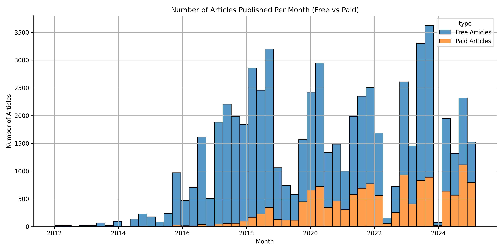
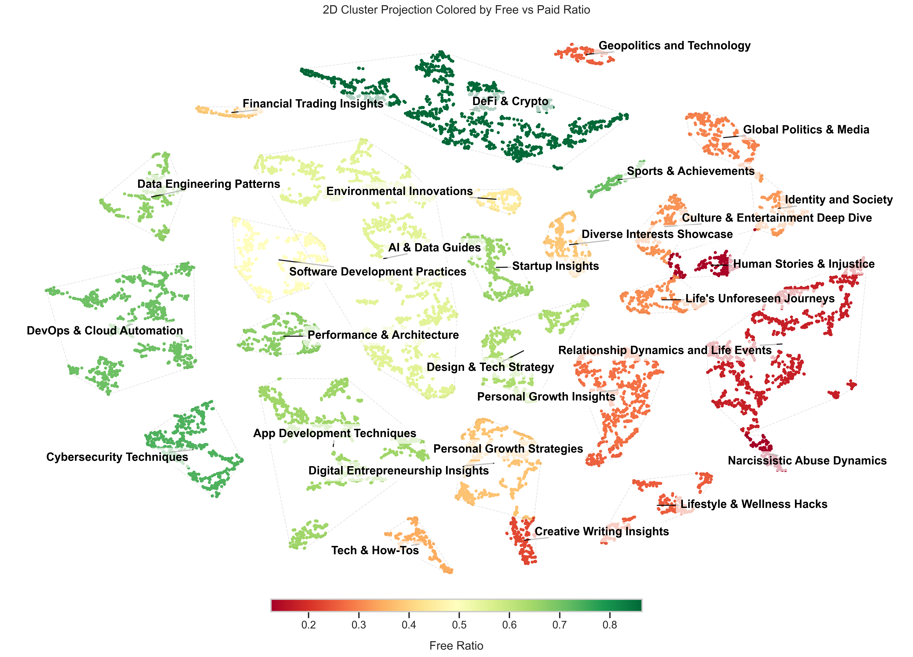

# Comparative Analysis of Paid and Free Articles on Medium.com

<div align="center">

**Analyzing 33,510 Medium.com articles (2020-2025) to understand engagement patterns and monetization strategies**


</div>

---

## Overview

This project analyzes Medium.com articles to identify engagement differences between paid (member-only) and free content. Using web scraping, embeddings-based topic modeling, and statistical analysis, we reveal how article topic strongly predicts monetization strategy.

**Key Findings:**
- Paid articles receive **3.3× more claps** and **4.1× more responses** (p < 0.001)
- Technical topics (86% crypto) predominantly free; personal topics (83% wellness) predominantly paid
- All major findings are statistically significant (p < 0.001)

---

## Data & Dataset

**Raw Dataset**: 65,248 scraped articles
**Analysis Period**: 2020-2025 (post-membership adoption)
**Final Dataset**: 33,510 articles | 24,639 authors | 83,064 responses



| Metric | Paid | Free |
|--------|------|------|
| Count | 11,262 (33.6%) | 22,248 (66.4%) |
| Claps (mean) | 407.9 | 122.4 |
| Responses (mean) | 4.9 | 1.2 |
| Reading Time (mean) | 6.0 min | 5.9 min |

### Statistical Hypothesis Testing

Two-sample t-tests revealed **statistically significant differences** across all metrics:

| Metric | t-statistic | p-value | Effect |
|--------|------------|---------|--------|
| Clap Count | 54.69 | < 0.001 | 3.3× higher (paid) |
| Response Count | 53.86 | < 0.001 | 4.1× higher (paid) |
| Reading Time | 2.26 | 0.024 | Marginally longer (paid) |

---

## Topic Modeling Results

**Methodology**: Embeddings (mini-gte) → UMAP (3D) → DBSCAN clustering → t-SNE visualization



**Key Finding**: Clear gradient from technical topics (predominantly free) to personal topics (predominantly paid)

| Theme | Size | % Free | % Paid | Significance |
|-------|------|--------|--------|--------------|
| Crypto & Web3 | 1,489 | 86.2% | 13.8% | *** |
| Emerging Tech & Engineering | 5,746 | 63.5% | 36.5% | *** |
| Product, Business & Growth | 1,973 | 52.1% | 47.9% | *** |
| Society, Culture & Global | 1,487 | 33.1% | 66.9% | *** |
| Personal & Emotional Life | 2,515 | 24.0% | 76.0% | *** |
| Health & Well-being | 492 | 16.7% | 83.3% | *** |
| Creativity & Curiosity | 1,358 | 52.0% | 48.0% | *** |

**Interpretation**: Topic choice is a strong predictor of monetization strategy (all p < 0.001)

---

## AI Detection Results

**Methodology**: SuperAnnotate's "ai-detector-low-fpr" model with sentence-level + sliding-window scoring


| Article Type | Mean AI Score | Median | Std. Dev. | p-value |
|--------------|---------------|--------|----------|---------|
| Paid | 0.392 | 0.383 | 0.119 | 0.065 (ns) |
| Free | 0.389 | 0.381 | 0.130 | |


**Finding**: No statistically significant difference in AI-generated content (p = 0.065). Slight upward trend after ChatGPT release (late 2022).

---

## Grammar Analysis Results

**Methodology**: LanguageTool for grammar/style error detection


| Metric | Paid | Free | Effect Size |
|--------|------|------|-------------|
| Mean errors | 12.84 | 16.85 | d = 0.117 (small) |
| t-statistic | 9.996 | | p < 0.001 *** |

**Finding**: Paid articles have statistically fewer grammar errors, but effect size is small. Free articles show more foundational grammar errors; paid articles show more repetitions/style issues.

---

## Methodology & Data Collection

- **Web Scraping**: Playwright-based scraping from 32M sitemap URLs (6 hrs, respectful rate limiting)
- **Database**: DuckDB for efficient analytical queries
- **Embeddings**: prdev/mini-gte (768 dimensions, MTEB top performer)
- **Topic Modeling**: UMAP (3D) + DBSCAN clustering + t-SNE visualization
- **Analysis**: Statistical testing, descriptive statistics, AI detection, grammar analysis

---

## Reproduction Quick Start

### Prerequisites
- Python 3.12 + Poetry
- DuckDB
- Optional: GPU for embedding generation

### Setup & Run
```bash
git clone https://github.com/M-Enderle/Medium-Mining.git
cd Medium-Mining
poetry install
poetry shell

# Run analysis notebooks in order:
jupyter notebook analyze/01_descriptive.ipynb      # Descriptive stats
jupyter notebook analyze/02_create_embeddings.ipynb # Embeddings
python analyze/03_topic_modeling.py                 # Topic modeling
jupyter notebook analyze/04_ai_detection.ipynb      # AI detection
jupyter notebook analyze/05_grammar_analysis.ipynb  # Grammar analysis
```

### Pre-Generated Data
All embeddings, UMAP coordinates, and results are in `analyze/embeddings/` and `analyze/UMAP/`

---

## Performance Summary

- **Scraping**: 65,248 articles, 99.2% success rate, ~72 hours (8 workers)
- **Embeddings**: 2-4 hours (GPU), 768-dim vectors
- **Topic Modeling**: 30-45 minutes (UMAP + DBSCAN + t-SNE)
- **Statistical Analysis**: < 5 minutes

---

## License & Attribution

Licensed under MIT. Data sourced from Medium.com. Research conducted at **Johannes Kepler University Linz, Austria**.

This research was conducted with explicit permission from Medium's legal department.

<div align="center">

**Built with Python, Playwright, DuckDB, and PyTorch**

</div>