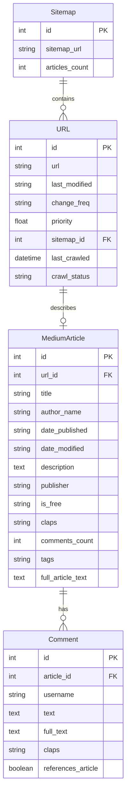

# Database Schema

Medium-Mining uses a DuckDB database with an SQLAlchemy ORM layer to store and manage data. This document provides a detailed overview of the database schema and relationships.

## Database Configuration

The database is configured in the `src/database/database.py` file:

```python
DATABASE_URL = "duckdb:///medium_articles.duckdb"  # Persistent storage
Base = declarative_base()
engine = create_engine(DATABASE_URL, echo=False)
SessionLocal = sessionmaker(autocommit=False, autoflush=False, bind=engine)
```

## Entity Relationship Diagram

The following diagram illustrates the relationships between the database tables:



## Tables and Models

### `Sitemap` Model

The `Sitemap` model represents a Medium sitemap that has been processed:

```python
class Sitemap(Base):
    __tablename__ = "sitemaps"
    sitemap_id_seq = Sequence("sitemap_id_seq")

    id = Column(
        "id",
        Integer,
        sitemap_id_seq,
        server_default=sitemap_id_seq.next_value(),
        primary_key=True,
    )
    sitemap_url = Column(String(255), unique=True, nullable=False)
    articles_count = Column(Integer)
```

| Field | Type | Description |
|-------|------|-------------|
| `id` | Integer | Primary key for the sitemap |
| `sitemap_url` | String | URL of the sitemap (unique) |
| `articles_count` | Integer | Number of articles in the sitemap |

### `URL` Model

The `URL` model represents an article URL extracted from a sitemap:

```python
class URL(Base):
    __tablename__ = "urls"
    url_id_seq = Sequence("url_id_seq")

    id = Column(
        "id",
        Integer,
        url_id_seq,
        server_default=url_id_seq.next_value(),
        primary_key=True,
    )

    url = Column(String(255), unique=True, nullable=False)
    last_modified = Column(String(50))
    change_freq = Column(String(50))
    priority = Column(Float)
    sitemap_id = Column(Integer, ForeignKey("sitemaps.id"))
    last_crawled = Column(DateTime, nullable=True)
    crawl_status = Column(String(50), nullable=True)
```

| Field | Type | Description |
|-------|------|-------------|
| `id` | Integer | Primary key for the URL |
| `url` | String | The article URL (unique) |
| `last_modified` | String | Last modification date from sitemap |
| `change_freq` | String | Change frequency from sitemap (e.g., "daily", "monthly") |
| `priority` | Float | Priority from sitemap (0.0-1.0) |
| `sitemap_id` | Integer | Foreign key to the Sitemap table |
| `last_crawled` | DateTime | When the URL was last crawled |
| `crawl_status` | String | Status of the last crawl (e.g., "Successful", "Failed") |

### `MediumArticle` Model

The `MediumArticle` model represents a Medium article with its content and metadata:

```python
class MediumArticle(Base):
    __tablename__ = "medium_articles"
    article_id_seq = Sequence("article_id_seq")

    id = Column(
        "id",
        Integer,
        article_id_seq,
        server_default=article_id_seq.next_value(),
        primary_key=True,
    )
    url_id = Column(Integer, ForeignKey("urls.id"))
    title = Column(String(255), nullable=False)
    author_name = Column(String(100))
    date_published = Column(String(50))
    date_modified = Column(String(50))
    description = Column(Text)
    publisher = Column(String(100))
    is_free = Column(String(50))
    claps = Column(String(20))
    comments_count = Column(Integer)
    tags = Column(String(255))
    full_article_text = Column(Text)
```

| Field | Type | Description |
|-------|------|-------------|
| `id` | Integer | Primary key for the article |
| `url_id` | Integer | Foreign key to the URL table |
| `title` | String | Article title |
| `author_name` | String | Name of the article author |
| `date_published` | String | Original publication date |
| `date_modified` | String | Last modification date |
| `description` | Text | Article description or subtitle |
| `publisher` | String | Publisher name (e.g., a Medium publication) |
| `is_free` | String | Access type (e.g., "Public", "Member-Only", "Paid") |
| `claps` | String | Number of claps (likes) |
| `comments_count` | Integer | Number of comments |
| `tags` | String | Comma-separated list of article tags |
| `full_article_text` | Text | Complete article content |

### `Comment` Model

The `Comment` model represents a comment on a Medium article:

```python
class Comment(Base):
    __tablename__ = "comments"
    comment_id_seq = Sequence("comment_id_seq")

    id = Column(
        "id",
        Integer,
        comment_id_seq,
        server_default=comment_id_seq.next_value(),
        primary_key=True,
    )
    article_id = Column(Integer, ForeignKey("medium_articles.id"))
    username = Column(String(100))
    text = Column(Text)
    full_text = Column(Text)
    claps = Column(String(20))
    references_article = Column(Boolean)
```

| Field | Type | Description |
|-------|------|-------------|
| `id` | Integer | Primary key for the comment |
| `article_id` | Integer | Foreign key to the MediumArticle table |
| `username` | String | Username of the commenter |
| `text` | Text | Main text content of the comment |
| `full_text` | Text | Complete comment with any formatting or quotes |
| `claps` | String | Number of claps (likes) on the comment |
| `references_article` | Boolean | Whether the comment quotes the article |

## Database Initialization

The database and tables are created using the `setup_database()` function in `database.py`:

```python
def setup_database():
    """Create the database and tables if they don't exist."""
    try:
        Base.metadata.create_all(engine)
        print("Database and tables created successfully.")
    except Exception as e:
        print(f"Error creating database: {e}")
```

This function is called when the database module is run directly:

```python
if __name__ == "__main__":
    # Set up the database
    setup_database()
```

## Session Management

Sessions for database operations are managed using the `get_session()` function:

```python
def get_session():
    """Get a SQLAlchemy session for database operations."""
    return SessionLocal()
```

This function is used throughout the application to obtain a session for database operations.

## Query Examples

### Fetch Random URLs for Processing

```python
def fetch_random_urls(session, count=None) -> List[Tuple[int, str]]:
    """Fetch random URLs from the database."""
    query = session.query(URL.id, URL.url).filter(URL.last_crawled == None)

    # Use the provided count, or fall back to the global URLS_TO_FETCH
    limit = count if count is not None else URLS_TO_FETCH
    query = query.order_by(func.random()).limit(limit)

    logger.debug(f"Fetching {limit} random URLs from database")
    return query.all()
```

### Update URL Status After Crawling

```python
def update_url_status(session, url_id: int, success: bool):
    """Update the URL's last_crawled timestamp and crawl_status."""
    try:
        url = session.query(URL).filter(URL.id == url_id).first()
        if url:
            url.last_crawled = datetime.now()
            url.crawl_status = "Successful" if success else "Failed"
            session.commit()
            logger.debug(f"Updated URL {url_id} status: {success}")
    except Exception as e:
        session.rollback()
        logger.error(f"DB error for URL {url_id}: {e}")
```

### Persist Article Data

```python
def persist_article_data(session, url_id: int, metadata: Dict[str, Any]) -> bool:
    """Save article metadata and comments to the database."""
    try:
        # Code to save article data
        # ...
        session.commit()
        return True
    except Exception as e:
        session.rollback()
        logger.error(f"Failed to save article: {e}")
        return False
```

## Database Performance Considerations

- **Batch Operations**: For bulk data insertion, use SQLAlchemy's `bulk_save_objects` method to improve performance
- **Indexing**: Key columns like `url` in the `URL` table are indexed for faster queries
- **Connection Pooling**: SQLAlchemy's connection pooling is used to manage database connections efficiently
- **Session Scope**: Sessions are created and closed for each operation to avoid resource leaks
- **Transactions**: All operations use transactions to ensure data consistency
- **Error Handling**: All database operations include error handling and rollback in case of exceptions