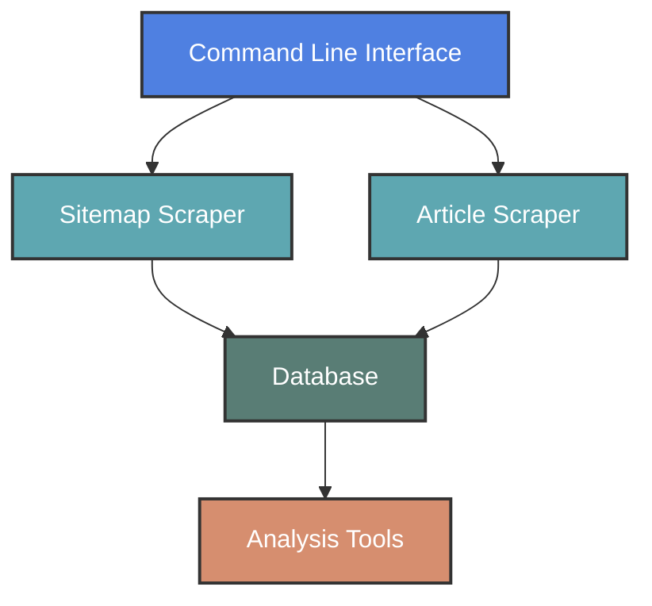
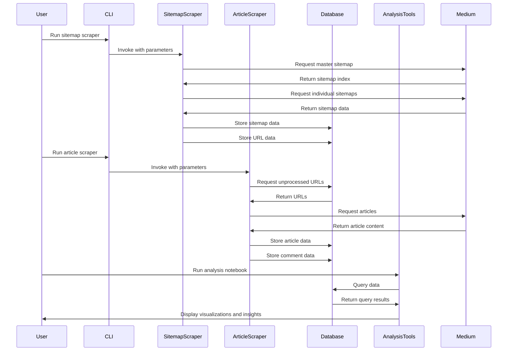

# Architecture Overview

Medium-Mining follows a modular architecture designed for extensibility, maintainability, and performance. This document provides a high-level overview of the system's architecture, its major components, and how they interact.

## High-Level Architecture

The Medium-Mining system is composed of several major components:

## Component Descriptions

### Command Line Interface

The CLI serves as the entry point for the application, providing a user-friendly way to interact with the scrapers:

- Implemented in `src/scraper/__main__.py`
- Uses Python's `argparse` library for command-line argument parsing
- Provides subcommands for different operations:
  - `sitemap`: Run the sitemap scraper
  - `article`: Run the article scraper
- Each subcommand has its own set of parameters for customization

### Sitemap Scraper

The Sitemap Scraper is responsible for discovering Medium article URLs by crawling Medium's XML sitemaps:

- Implemented in `src/scraper/scrape_sitemaps.py`
- Uses Python's standard libraries to parse XML
- Features:
  - Retrieves the master sitemap index
  - Processes individual sitemaps
  - Extracts article URLs and metadata
  - Stores results in the database
  - Handles rate limiting and error recovery

### Article Scraper

The Article Scraper extracts content and metadata from individual Medium articles:

- Implemented in `src/scraper/scrape_articles.py` and `src/scraper/medium_helpers.py`
- Uses Playwright for browser automation
- Features:
  - Multi-threaded processing for improved performance
  - Extracts article text, metadata, and comments
  - Detects member-only vs. public articles
  - Captures screenshots for verification
  - Provides detailed performance metrics

### Database Layer

The Database layer provides persistent storage and retrieval capabilities:

- Implemented in `src/database/database.py`
- Uses SQLAlchemy ORM with DuckDB as the backend
- Features:
  - Model definitions for sitemaps, URLs, articles, and comments
  - Session management
  - Database initialization and migration
  - ACID transactions for data integrity

### Analysis Tools

The Analysis tools provide capabilities for extracting insights from the collected data:

- Implemented in Jupyter notebooks in the `notebooks/` directory
- Uses pandas, matplotlib, seaborn, and other data science libraries
- Features:
  - Descriptive statistics
  - Visualization of trends and patterns
  - Natural language processing for content analysis
  - Export capabilities for external tools

## Data Flow

The following diagram illustrates the flow of data through the Medium-Mining system:

## Technology Stack

Medium-Mining leverages several technologies to accomplish its goals:

| Component | Technologies |
|-----------|--------------|
| Scraping | Python, requests, Playwright, asyncio |
| Database | SQLAlchemy, DuckDB |
| Analysis | pandas, matplotlib, seaborn, scipy |
| Development | Poetry, Black, isort |
| Documentation | MkDocs, Material for MkDocs |

## Design Principles

The Medium-Mining architecture adheres to several key design principles:

### Modularity

The system is divided into separate components with well-defined responsibilities, making it easier to maintain and extend:

- Scraper components are independent of each other
- Database models are defined separately from scraping logic
- Analysis tools are separate from data collection

### Configurability

Each component can be configured to adapt to different requirements:

- Command-line arguments for controlling scraper behavior
- Database connection parameters for different storage backends
- Analysis parameters for different types of insights

### Scalability

The architecture is designed to handle large volumes of data efficiently:

- Asynchronous processing in the sitemap scraper
- Multi-threaded processing in the article scraper
- Batch operations for database efficiency
- DuckDB for efficient analytical queries

### Resilience

The system includes mechanisms for handling errors and recovering from failures:

- Retry logic for network operations
- Graceful shutdown for interruptions
- Error handling at multiple levels
- Transaction management for data integrity

## Extensibility

Medium-Mining's architecture is designed to be extensible. Here are some ways to extend the system:

### Adding New Scraper Types

1. Create a new Python module in the `src/scraper/` directory
2. Implement the scraper logic
3. Add a new subcommand to the CLI in `__main__.py`

### Enhancing Data Extraction

1. Add new extraction functions to `medium_helpers.py`
2. Update the article processing logic in `scrape_articles.py`
3. Modify the database models to store the new data

### Adding New Analysis Techniques

1. Create a new Jupyter notebook in the `notebooks/` directory
2. Implement the analysis logic using the database models
3. Add visualizations and insights extraction

## Performance Considerations

The architecture includes several optimizations for performance:

- **Asynchronous I/O**: The sitemap scraper uses `asyncio` for concurrent network operations
- **Multi-threading**: The article scraper uses multiple threads for parallel processing
- **Batch Operations**: Database operations are performed in batches when possible
- **Connection Pooling**: SQLAlchemy's connection pooling reduces connection overhead
- **Analytical Database**: DuckDB is optimized for analytical queries on large datasets

## Security Considerations

While Medium-Mining is a research tool, it includes several security considerations:

- **Rate Limiting**: Configurable delays between requests to avoid overwhelming Medium's servers
- **Isolated Browser Contexts**: Each browser instance runs in an isolated context
- **Error Handling**: Comprehensive error handling to prevent data leakage
- **Input Validation**: Command-line arguments are validated before use

## Next Steps

- Learn more about the [Project Structure](project-structure.md)
- Explore the [Database Schema](database-schema.md)
- Understand the [Data Flow](data-flow.md) in more detail