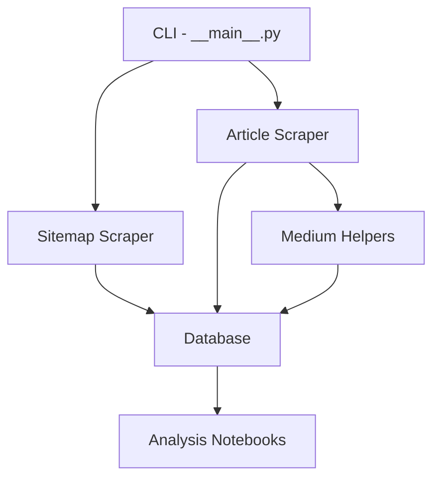

# Project Structure

This document outlines the organization of the Medium-Mining project, explaining the purpose of each directory and key files.

## Directory Structure

```
Medium-Mining/
├── docs/                  # Documentation files
├── notebooks/             # Jupyter notebooks for analysis
├── screenshots/           # Screenshots taken during scraping (created at runtime)
├── src/                   # Source code
│   ├── database/          # Database models and utilities
│   │   └── database.py    # Database configuration and models
│   └── scraper/           # Web scraping modules
│       ├── __main__.py    # Command line interface entry point
│       ├── medium_helpers.py  # Helper functions for scraping Medium
│       ├── scrape_articles.py # Article scraper implementation
│       └── scrape_sitemaps.py # Sitemap scraper implementation
├── .gitignore             # Git ignore file
├── CLAUDE.md              # Project guidelines for Claude AI
├── LICENSE                # Project license
├── README.md              # Project overview and documentation
├── medium_articles.duckdb # Database file (created at runtime)
├── mkdocs.yml             # MkDocs configuration
├── poetry.lock            # Poetry lock file with exact dependencies
└── pyproject.toml         # Poetry project configuration
```

## Key Components

### Source Code (`src/`)

The `src/` directory contains all the Python source code for the project, organized into modules:

#### `database/` Module

- **Purpose**: Defines database models and provides utilities for database operations
- **Key Files**:
  - `database.py`: Contains SQLAlchemy models, connection setup, and utility functions

#### `scraper/` Module

- **Purpose**: Implements web scraping functionality for Medium
- **Key Files**:
  - `__main__.py`: Entry point for the command-line interface
  - `medium_helpers.py`: Helper functions specific to Medium website structure
  - `scrape_articles.py`: Implementation of the article scraper
  - `scrape_sitemaps.py`: Implementation of the sitemap scraper

### Analysis Notebooks (`notebooks/`)

- **Purpose**: Contains Jupyter notebooks for analyzing the scraped data
- **Key Files**:
  - `analyze_scraping_results.ipynb`: Main analysis notebook with examples

### Documentation (`docs/`)

- **Purpose**: Contains comprehensive documentation for the project
- **Structure**:
  - Organized into sections by topic (getting started, modules, architecture, etc.)
  - Uses MkDocs with Material theme for rendering

### Configuration Files

- **pyproject.toml**: Project metadata and dependencies managed by Poetry
- **poetry.lock**: Locked dependencies for reproducible environments
- **mkdocs.yml**: Configuration for the documentation site

### Runtime Generated Files

- **medium_articles.duckdb**: DuckDB database file created at runtime
- **screenshots/**: Directory containing screenshots captured during article scraping

## Module Relationships

The following diagram illustrates the relationships between the main modules:



## Dependencies

The project's dependencies are managed using Poetry and defined in `pyproject.toml`:

- **Core Dependencies**:
  - `sqlalchemy`: ORM for database operations
  - `requests`: HTTP client for sitemap scraping
  - `playwright`: Browser automation for article scraping
  - `duckdb` & `duckdb-engine`: Database and SQLAlchemy dialect

- **Analysis Dependencies**:
  - `pandas`: Data manipulation
  - `seaborn`: Data visualization
  - `scipy`: Scientific computing
  
- **Development Dependencies**:
  - `black`: Code formatting
  - `isort`: Import sorting
  - `ipykernel`: Jupyter kernel for notebooks

- **Documentation Dependencies**:
  - `mkdocs`: Documentation generator
  - `mkdocs-material`: Material theme for MkDocs
  - `pymdown-extensions`: Extended Markdown features
  - `mkdocstrings`: API documentation from docstrings

## Entry Points

The project provides the following entry points:

### Command Line Interface

```bash
# Run sitemap scraper
python -m scraper sitemap [options]

# Run article scraper
python -m scraper article [options]
```

### Database Initialization

```bash
# Initialize the database
python -m database.database
```

### Documentation

```bash
# Serve documentation site locally
mkdocs serve

# Build static documentation site
mkdocs build
```

## Customization Points

The project architecture includes several points for customization:

- **Database Models**: Add or modify models in `database.py`
- **Scraping Logic**: Extend scraping capabilities in `medium_helpers.py`
- **CLI Options**: Add new command-line options in `__main__.py`
- **Analysis**: Create new notebooks in the `notebooks/` directory

## Package Organization

The project uses Poetry's package management with explicit package declarations:

```toml
[tool.poetry]
packages = [
    { include = "scraper", from = "src" },
    { include = "database", from = "src" }
]
```

This ensures that when the project is installed, the modules are available as:

```python
from scraper import scrape_articles
from database import database
```

## Development Workflow

The typical development workflow involves:

1. Making changes to the source code
2. Formatting with Black and isort:
   ```bash
   poetry run black src/ && poetry run isort src/
   ```
3. Testing changes by running the appropriate command
4. Documenting changes in the relevant documentation files
5. Committing changes with descriptive messages