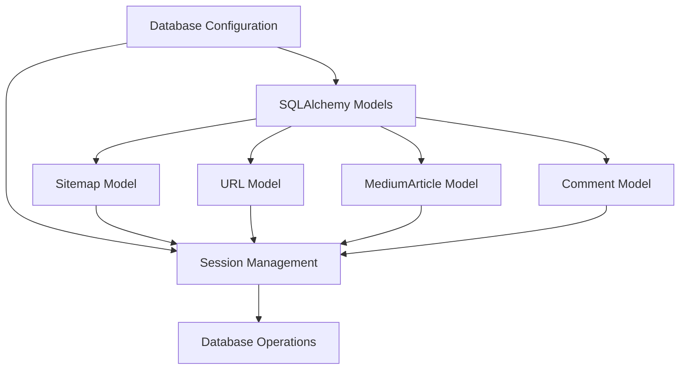

# Database Module Overview

The database module is a core component of the Medium-Mining project, providing persistent storage and retrieval capabilities for all scraped data. It uses SQLAlchemy ORM with DuckDB as the backend, offering a balance of simplicity, performance, and analytical capabilities.

## Key Components

The database module consists of the following key components:



### Database Configuration

The database is configured in `src/database/database.py`:

```python
DATABASE_URL = "duckdb:///medium_articles.duckdb"  # Persistent storage
Base = declarative_base()
engine = create_engine(DATABASE_URL, echo=False)
SessionLocal = sessionmaker(autocommit=False, autoflush=False, bind=engine)
```

This configuration:
- Uses DuckDB as the database engine
- Stores data in a local file called `medium_articles.duckdb`
- Disables SQL echo for production use
- Creates a session factory for thread-safe database access

### SQLAlchemy Models

The module defines four main models:

1. **Sitemap**: Represents a processed Medium sitemap
2. **URL**: Represents an article URL extracted from a sitemap
3. **MediumArticle**: Represents a scraped article with its content and metadata
4. **Comment**: Represents a comment on an article

Each model uses SQLAlchemy's declarative syntax to define tables, columns, and relationships.

### Session Management

Database sessions are managed through the `SessionLocal` factory and the `get_session()` utility function:

```python
def get_session():
    """Get a SQLAlchemy session for database operations."""
    return SessionLocal()
```

This function is used throughout the application to obtain a session for database operations.

## Database Features

### Schema Definition

The database schema is defined using SQLAlchemy's declarative syntax:

```python
class MediumArticle(Base):
    __tablename__ = "medium_articles"
    article_id_seq = Sequence("article_id_seq")

    id = Column(
        "id",
        Integer,
        article_id_seq,
        server_default=article_id_seq.next_value(),
        primary_key=True,
    )
    url_id = Column(Integer, ForeignKey("urls.id"))
    title = Column(String(255), nullable=False)
    # ... other columns ...
```

### Relationships

The models define relationships between tables:

- Sitemap → URL: One-to-many (one sitemap contains many URLs)
- URL → MediumArticle: One-to-one (one URL corresponds to one article)
- MediumArticle → Comment: One-to-many (one article has many comments)

### Initialization

The database and tables are created using the `setup_database()` function:

```python
def setup_database():
    """Create the database and tables if they don't exist."""
    try:
        Base.metadata.create_all(engine)
        print("Database and tables created successfully.")
    except Exception as e:
        print(f"Error creating database: {e}")
```

## Usage Examples

### Creating a Session

```python
from database.database import get_session

# Create a session
session = get_session()

try:
    # Use the session for database operations
    # ...
    session.commit()
except Exception as e:
    session.rollback()
    raise e
finally:
    session.close()
```

### Querying Data

```python
from database.database import URL, MediumArticle, get_session

# Create a session
session = get_session()

try:
    # Query all URLs that haven't been crawled yet
    uncrawled_urls = session.query(URL).filter(URL.last_crawled == None).all()
    
    # Query articles with specific tags
    python_articles = session.query(MediumArticle).filter(
        MediumArticle.tags.like("%python%")
    ).all()
    
    # Count articles by publisher
    publisher_counts = session.query(
        MediumArticle.publisher, func.count(MediumArticle.id)
    ).group_by(MediumArticle.publisher).all()
finally:
    session.close()
```

### Inserting Data

```python
from database.database import URL, Sitemap, get_session

# Create a session
session = get_session()

try:
    # Create a new sitemap
    sitemap = Sitemap(sitemap_url="https://medium.com/sitemap/example.xml", articles_count=100)
    session.add(sitemap)
    session.flush()  # Flush to get the sitemap ID
    
    # Create a new URL
    url = URL(
        url="https://medium.com/example-article",
        last_modified="2023-01-01",
        change_freq="monthly",
        priority=0.8,
        sitemap_id=sitemap.id
    )
    session.add(url)
    
    # Commit the transaction
    session.commit()
except Exception as e:
    session.rollback()
    raise e
finally:
    session.close()
```

### Batch Operations

For efficiency, the database module supports batch operations:

```python
from database.database import URL, get_session

# Create a session
session = get_session()

try:
    # Create multiple URL objects
    urls = [
        URL(url=f"https://medium.com/article-{i}", sitemap_id=1)
        for i in range(1000)
    ]
    
    # Add them in a batch
    session.bulk_save_objects(urls)
    
    # Commit the transaction
    session.commit()
except Exception as e:
    session.rollback()
    raise e
finally:
    session.close()
```

## Database Performance

### DuckDB Benefits

DuckDB offers several advantages for this project:

- **Embedded Database**: No need for a separate database server
- **Column-Oriented**: Efficient for analytical queries
- **ACID Transactions**: Ensures data integrity
- **SQL Compatibility**: Familiar query language
- **SQLAlchemy Support**: Easy integration with Python

### Optimization Techniques

The database module employs several optimization techniques:

1. **Batch Operations**: Using `bulk_save_objects` for efficient batch inserts
2. **Connection Pooling**: Through SQLAlchemy's session management
3. **Indexing**: Primary keys and foreign keys are indexed
4. **Transaction Management**: Proper use of commit and rollback

## Thread Safety

The database module is designed to be thread-safe:

- **Session Factory**: Each thread creates its own session
- **Session Scope**: Sessions are properly closed after use
- **Connection Pooling**: SQLAlchemy handles connection pooling
- **Transactions**: ACID transactions ensure consistency

## Extension Points

The database module can be extended in several ways:

### Adding New Models

To add a new model:

1. Define a new class inheriting from `Base`
2. Define columns and relationships
3. Run `setup_database()` to create the new table

### Using a Different Database

To use a different database backend:

1. Change the `DATABASE_URL` to point to the new database
2. Install the appropriate SQLAlchemy dialect
3. Update any database-specific code
4. Migrate existing data if needed

### Adding Indexes

To optimize specific queries:

1. Add indexes to frequently queried columns
2. Use SQLAlchemy's `Index` class
3. Consider performance implications for writes

## Next Steps

- Learn about [Database Models](models.md) in detail
- Explore [Database Connections](connections.md) for advanced usage
- Understand [Database Migrations](migrations.md) for schema changes