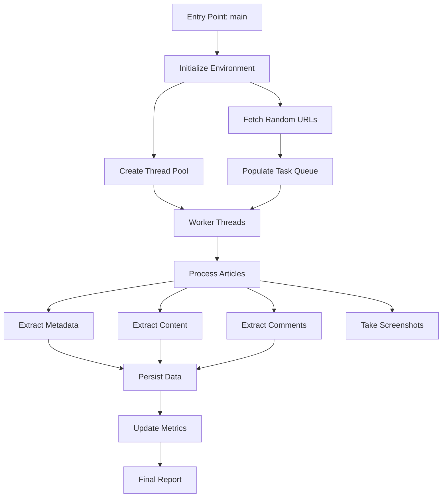

# Article Scraper

The Article Scraper is a sophisticated component responsible for extracting content and metadata from Medium articles. It uses Playwright for browser automation to render JavaScript content and extract data that would be difficult or impossible to obtain with traditional HTTP requests.

## Architecture

The Article Scraper follows a multi-threaded architecture with a worker pool design pattern:



## Key Components

### Main Execution Flow (`main` function)

```python
def main():
    """Main execution function."""
    global start_time
    start_time = time.time()

    signal.signal(signal.SIGINT, handle_signal)
    signal.signal(signal.SIGTERM, handle_signal)

    threads = []
    metrics_thread = None

    try:
        # Use a session factory for thread safety
        session_factory = SessionLocal
        url_data = []

        with session_factory() as session:  # Get URLs in a separate session
            url_data = fetch_random_urls(session)

        logging.debug(
            f"Starting to process {len(url_data)} URLs with {MAX_CONCURRENT} workers"
        )
        task_queue = Queue()

        def create_browser(playwright):
            return playwright.chromium.launch(
                headless=HEADLESS,
                args=["--disable-blink-features=AutomationControlled"],
            )

        for i in range(MAX_CONCURRENT):
            thread = Thread(
                target=worker_thread,
                args=(task_queue, create_browser, session_factory),
                daemon=True,
            )
            threads.append(thread)
            thread.start()

        metrics_stop = Event()
        metrics_thread = Thread(
            target=quiet_metrics_monitor, args=(metrics_stop,), daemon=True
        )
        metrics_thread.start()

        for i, url in enumerate(url_data):
            task_queue.put((url, i))

        for _ in range(MAX_CONCURRENT):
            task_queue.put(None)

        while not task_queue.empty() and not shutdown_event.is_set():
            time.sleep(1)

        if shutdown_event.is_set():
            logging.warning("Shutting down gracefully...")

        for thread in threads:
            thread.join(timeout=5)
        metrics_stop.set()

        if metrics_thread:
            metrics_thread.join(timeout=2)

    except Exception as e:
        logging.error(f"Unhandled error: {e}", exc_info=True)
    finally:
        display_final_metrics()
```

### Worker Thread Management

The Article Scraper uses a thread pool to process multiple articles concurrently:

```python
def worker_thread(task_queue, browser_factory, session_factory):
    """Worker thread to process URLs."""
    while not shutdown_event.is_set():
        try:
            task = task_queue.get(timeout=1)
            if task is None:
                break
            url_data, worker_idx = task
            with sync_playwright() as p:
                browser = browser_factory(p)
                try:
                    with session_factory() as session:  # Create a session for each task
                        process_article(url_data, browser, worker_idx, session)
                finally:
                    try:
                        browser.close()
                    except:
                        pass  # Ignore browser close errors
                task_queue.task_done()
        except Exception as e:
            if not shutdown_event.is_set():
                logging.error(f"Worker thread error: {e}")
```

### Article Processing

Each article is processed by extracting its content, metadata, and comments:

```python
def process_article(url_data, browser, worker_idx: int, session: Session):
    """Process an article: extract, save, and screenshot."""
    if shutdown_event.is_set():
        return

    url_id, url = url_data
    success = False
    metadata = {}  # Initialize metadata

    try:
        context = browser.new_context(
            viewport={"width": 390, "height": 844},  # iPhone 12
            user_agent="Mozilla/5.0 (iPhone; CPU iPhone OS 14_4 like Mac OS X) AppleWebKit/605.1.15 (KHTML, like Gecko) Version/14.0.3 Mobile/15E148 Safari/604.1",
            locale=random.choice(["en-US", "en-GB"]),
            device_scale_factor=2.0,
        )
        context.add_init_script(
            "Object.defineProperty(navigator,'webdriver',{get:()=>false});"
        )

        with context.new_page() as page:
            logging.debug(f"Processing URL: {url}")
            page.goto(url, wait_until="networkidle", timeout=30000)
            page.mouse.wheel(0, random.randint(100, 300))

            metadata = extract_metadata_and_comments(page)

            # Move persist_article_data inside the try block
            if persist_article_data(
                session, url_id, metadata
            ):  # Check the return value
                success = True

            filename = f"{worker_idx}_{datetime.now().strftime('%Y%m%d%H%M%S')}.png"
            page.screenshot(path=str(SCREENSHOT_DIR / filename), full_page=True)
            logging.debug(f"Saved screenshot to {filename}")

            update_metrics()  # Update metrics only on success

    except Exception as e:
        logging.error(f"Error on {url}")
    finally:
        update_url_status(session, url_id, success)
```

## Important Features

### Browser Configuration

The Article Scraper uses Playwright with Chromium in a carefully configured environment to avoid detection as a bot:

```python
context = browser.new_context(
    viewport={"width": 390, "height": 844},  # iPhone 12
    user_agent="Mozilla/5.0 (iPhone; CPU iPhone OS 14_4 like Mac OS X) AppleWebKit/605.1.15 (KHTML, like Gecko) Version/14.0.3 Mobile/15E148 Safari/604.1",
    locale=random.choice(["en-US", "en-GB"]),
    device_scale_factor=2.0,
)
context.add_init_script(
    "Object.defineProperty(navigator,'webdriver',{get:()=>false});"
)
```

This configuration:
- Sets the viewport to simulate a mobile device (iPhone 12)
- Uses a mobile user agent
- Randomizes the locale between US and UK English
- Sets an appropriate device scale factor for high-resolution displays
- Adds a script to hide the fact that it's a WebDriver-controlled browser

### Graceful Shutdown

The Article Scraper includes signal handlers for graceful shutdown:

```python
def handle_signal(signum, frame):
    """Signal handler for graceful shutdown."""
    logging.warning(f"Received signal {signum}, initiating shutdown...")
    shutdown_event.set()
```

This allows the scraper to cleanly terminate when interrupted (e.g., with Ctrl+C) by:
1. Setting a shutdown event flag
2. Allowing worker threads to complete their current tasks
3. Releasing resources properly (closing browsers, committing database changes)
4. Displaying final metrics before exit

### Performance Metrics

The Article Scraper tracks and reports performance metrics:

```python
def display_final_metrics():
    """Display final performance metrics."""
    global completed_tasks, start_time
    elapsed_time = time.time() - start_time
    speed = (
        completed_tasks / (elapsed_time / 60)
        if completed_tasks > 0 and elapsed_time > 0
        else 0
    )

    logging.info(f"=== FINAL PERFORMANCE SUMMARY ===")
    logging.info(f"Total processed: {completed_tasks} articles")
    logging.info(f"Average speed: {speed:.2f} articles/minute")
    logging.info(f"Total time: {elapsed_time/60:.1f} minutes")
    if speed > 0:
        logging.info(f"Processing time per article: {60/speed:.2f} seconds")
```

This provides valuable information about:
- Total articles processed
- Processing speed (articles per minute)
- Total runtime
- Average time per article

### Screenshot Capture

For debugging and verification purposes, the Article Scraper captures screenshots of each article:

```python
filename = f"{worker_idx}_{datetime.now().strftime('%Y%m%d%H%M%S')}.png"
page.screenshot(path=str(SCREENSHOT_DIR / filename), full_page=True)
logging.debug(f"Saved screenshot to {filename}")
```

## Configuration Options

The Article Scraper can be configured through command-line arguments in `__main__.py`:

```python
# Article scraper subparser
article_parser = subparsers.add_parser("article", help="Scrape Medium articles")
article_parser.add_argument(
    "--url-count", type=int, help="Number of URLs to process"
)
article_parser.add_argument(
    "--headless",
    type=bool,
    help="Run browser in headless mode (default: False)",
    default=None,
    action="store_true"
)
article_parser.add_argument(
    "--workers",
    type=int,
    help="Number of concurrent workers (default: 1)",
)
```

These options provide flexibility to control:
- How many URLs to process in a single run
- Whether to run browsers in headless mode (invisible) or with visible windows
- How many worker threads to use for concurrent processing

## Example Usage

```bash
# Basic usage with default settings
poetry run python -m scraper article

# Process 100 URLs with 4 concurrent workers in headless mode
poetry run python -m scraper article --url-count 100 --workers 4 --headless true

# Process 10 URLs with visible browser windows (for debugging)
poetry run python -m scraper article --url-count 10 --headless false
```

## Advanced Topics

### Handling Member-Only Articles

The Article Scraper can detect if an article is behind Medium's paywall:

```python
# Check for paywall indicators
if page.query_selector('div[aria-label="Post Preview"]') or page.query_selector(
    "div.paywall-upsell-container"
):
    article_data["is_free"] = "Member-Only"
```

This information is stored in the database, allowing you to filter articles based on their access level.

### Extracting Comments

The Article Scraper includes sophisticated logic to extract comments, including clicking the "See all responses" button and scrolling to load all comments:

```python
def click_see_all_responses(page: Page) -> bool:
    """Click 'See all responses' button."""
    try:
        button = page.query_selector('button:has-text("See all responses")')
        if button:
            button.click(timeout=10000)
            page.wait_for_load_state("load", timeout=10000)
            return True
    except Exception as e:
        logger.warning(f"Failed to click responses button")
    return False


def scroll_to_load_comments(page: Page, max_scrolls: int = 100) -> None:
    """Scroll to load all comments."""
    html = page.content()
    for _ in range(max_scrolls):
        try:
            page.evaluate(
                """() => {
                    const dialog = document.querySelector('div[role="dialog"]');
                    if (dialog) dialog.lastElementChild.firstElementChild.scrollBy(0, 20000);
                }"""
            )
            page.wait_for_timeout(500)
            page.wait_for_load_state("load", timeout=5000)
            if page.content() == html:
                break
            html = page.content()
        except Exception as e:
            logger.warning(f"Scroll error: {e}")
            break
```

## Error Handling

The Article Scraper includes comprehensive error handling at multiple levels:

1. **Worker Thread Level**: Catches exceptions in the worker thread and logs errors
2. **Processing Level**: Catches exceptions during article processing and updates the URL status accordingly
3. **Browser Level**: Ensures browser resources are properly released even if errors occur
4. **Database Level**: Uses transactions with commit/rollback to maintain data integrity

## Next Steps

- Learn about the [Medium Helpers](medium-helpers.md) module for detailed extraction logic
- Review the [Sitemap Scraper](sitemap-scraper.md) that provides URLs to the Article Scraper
- Explore [Configuration](configuration.md) options for customizing the Article Scraper behavior