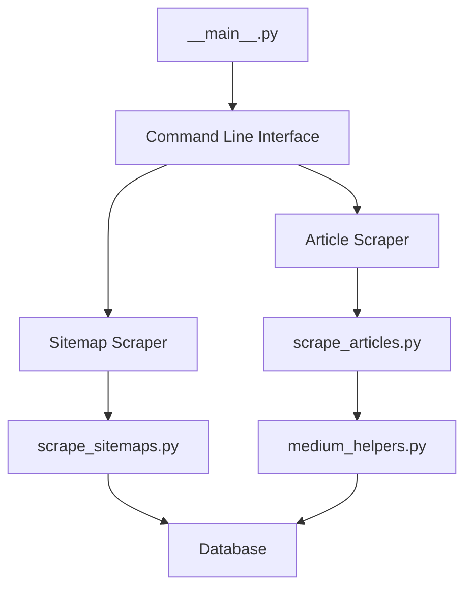
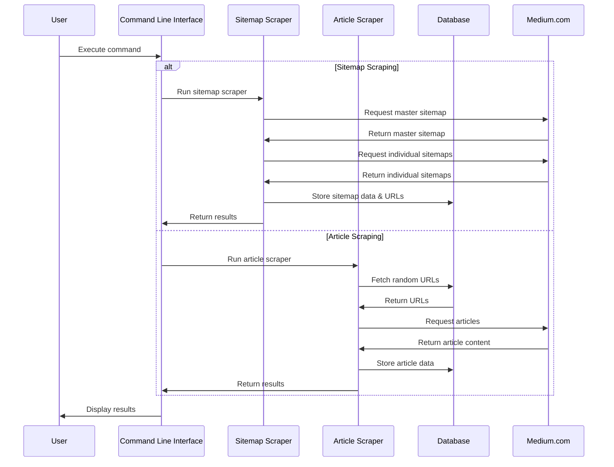

# Scraper Module Overview

The scraper module is the core component of the Medium-Mining project, responsible for extracting data from Medium.com. It consists of two main components:

1. **Sitemap Scraper**: Extracts article URLs from Medium's sitemaps
2. **Article Scraper**: Extracts content and metadata from individual articles

## Module Architecture

The scraper module is designed with a modular architecture that separates concerns and enables flexible extension:



## Key Components

### Command Line Interface (`__main__.py`)

The entry point for the scraper module that provides a command-line interface for running the sitemap and article scrapers. It handles argument parsing, logging configuration, and dispatches to the appropriate scraper based on the command.

```python
# Basic usage
python -m scraper sitemap  # Run sitemap scraper
python -m scraper article  # Run article scraper
```

### Sitemap Scraper (`scrape_sitemaps.py`)

Responsible for retrieving and processing Medium's XML sitemaps, extracting article URLs, and storing them in the database.

Key features:
- Asynchronous processing of multiple sitemaps
- Intelligent handling of rate limiting
- Efficient batch processing for database operations
- Automatic detection and skipping of already processed sitemaps

### Article Scraper (`scrape_articles.py`)

Extracts detailed content and metadata from Medium articles, including text, author information, publication date, claps, comments, and more.

Key features:
- Multi-threaded processing for improved performance
- Browser automation using Playwright
- Handling of both member-only and public articles
- Screenshot capture for debugging and verification
- Performance metrics tracking

### Helper Functions (`medium_helpers.py`)

Contains utility functions used by the article scraper to extract specific types of data from Medium articles and interact with the database.

Key features:
- Article text extraction
- Metadata extraction from JSON-LD
- Comment extraction and processing
- Database interaction utilities

## Execution Flow

The following sequence diagram illustrates the high-level execution flow of the scraper module:



## Configuration Options

The scraper module provides several configuration options to customize its behavior:

### Sitemap Scraper Options

| Option | Default | Description |
|--------|---------|-------------|
| `--timeout` | 0.05 | Average timeout between requests in seconds |
| `--verbose` | False | Enable verbose output to console |

### Article Scraper Options

| Option | Default | Description |
|--------|---------|-------------|
| `--url-count` | 50 | Number of URLs to process |
| `--headless` | False | Run browser in headless mode |
| `--workers` | 1 | Number of concurrent workers |

## Usage Examples

### Sitemap Scraper

```bash
# Basic usage
poetry run python -m scraper sitemap

# With custom timeout and verbose output
poetry run python -m scraper sitemap --timeout 0.1 --verbose
```

### Article Scraper

```bash
# Basic usage
poetry run python -m scraper article

# With custom URL count, headless mode, and multiple workers
poetry run python -m scraper article --url-count 100 --headless true --workers 4
```

## Extension Points

The scraper module is designed to be extensible. Here are the main points where you can extend or customize its functionality:

- **Custom Extractors**: Extend the extraction capabilities by adding new functions to `medium_helpers.py`
- **Alternative Browsers**: Modify the browser configuration in `scrape_articles.py` to use different browser types or configurations
- **Additional Metadata**: Add new fields to the database models and corresponding extraction logic
- **Custom Processing**: Implement post-processing logic for extracted data

## Next Steps

- Learn more about the [Sitemap Scraper](sitemap-scraper.md)
- Learn more about the [Article Scraper](article-scraper.md)
- Explore the [Medium Helpers](medium-helpers.md) functions
- Review the [Configuration](configuration.md) options